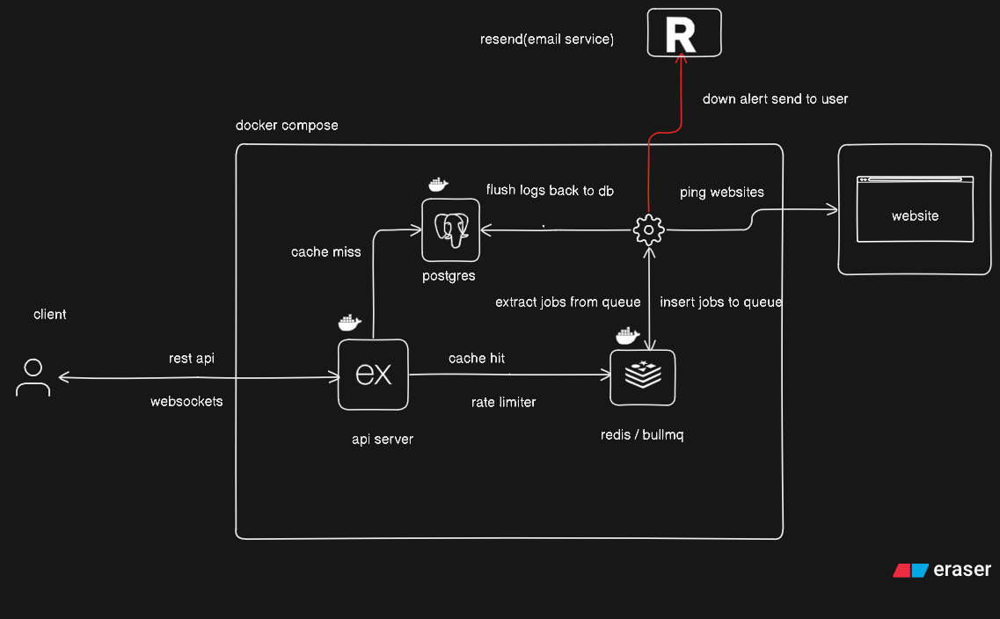

# NanoPing - High-Performance Website Monitoring Platform

A distributed, real-time website monitoring engine designed for scale and reliability. Built with a decoupled architecture to handle concurrent uptime checks, automated alerting, and beautiful telemetry visualization.

##  Features
- **Distributed Monitoring Engine**: Decoupled worker architecture using Redis and BullMQ to handle hundreds of concurrent pings without blocking the main event loop.
- **Wait-Free Logging Architecture**: High-frequency ping logs are first buffered in Redis and asynchronously bulk-inserted into PostgreSQL every 30 seconds to minimize database I/O pressure.
- **Event-Driven Real-time Updates**: Instant status refreshes and "Render-style" live logs powered by Socket.IO room-based broadcasting.
- **Secure JWT Authentication**: JWT-based authentication with refresh tokens and HTTP-only cookies for enhanced security.
- **Intelligent Alerting**: Multi-threshold failure tracking (Email) with built-in idempotency to prevent duplicate notifications during network instability.

---
## 📐 System Architecture

---

## 🛠 Tech Stack
| Layer | Technologies |
| :--- | :--- |
| **Frontend** | React 18, Vite, Tailwind CSS, Recharts, Lucide |
| **Backend** | Node.js (v18+), Express 5, Socket.IO, BullMQ, Axios |
| **Persistence** | PostgreSQL (Relational Data), Redis (Queue & High-speed Cache) |
| **DevOps** | Docker|

---


## 🛰 REST API Reference

### Auth & User
- `POST /api/auth/login` - Request JWT session
- `POST /api/auth/register` - Create account
- `GET /api/auth/me` - Profile context
- `POST /api/auth/logout` - Clear session

### Monitoring
- `POST /api/monitors` - Add new target URL
- `GET /api/monitors` - List user monitors (with pagination & status filtering)
- `GET /api/monitors/:id` - Detailed telemetry for a specific site
- `PUT /api/monitors/:id` - Update check intervals/thresholds
- `DELETE /api/monitors/:id` - Purge target & associated history

### Dashboard & Analytics
- `GET /api/dashboard/summary` - Aggregated global stats (Monitors Up vs Down)
- `GET /api/dashboard/global-stats` - 30-day uptime overview
- `GET /api/dashboard/all-monitor-stats` - Detailed multi-monitor health map

---

## ⚡ Quick Start (Local Setup)

1. **Spin up Infrastructure**:
   ```bash
   docker-compose up -d  # Starts PostgreSQL and Redis
   ```

2. **Backend Setup**:
   ```bash
   cd backend && npm install
   cp .env.example .env  # Configure your Postgres & Redis URLs
   npm run dev
   ```

3. **Frontend Setup**:
   ```bash
   cd frontend && npm install
   npm run dev
   ```

---

